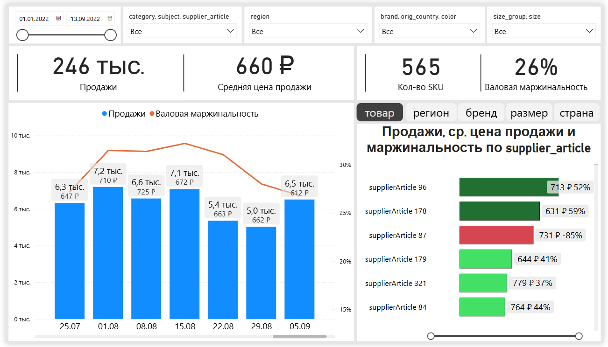

# Wildberries Seller Analytics
Modern Analytics Engineering project.

Python -> PostgreSQL -> dbt -> Power BI

## Sources
WB API и справочники селлера

## Architecture
01_project_setup -> 02_ingestion -> 03_postgres_raw -> 04_dbt_staging

-> 05_dbt_intermediate -> 06_dbt_marts -> 07_power_bi

## Dashboards
### 1. Операционный отчет по продажам

**Цель**: мониторинг рентабельности продаж

  

### 2. Отчет по товарным остаткам и оборачиваемости

**Цель**: следить за остатками и оборачиваемостью

### 3. Отчет по поставкам и исполнению заказов

**Цель**: следить за поставками

### 4. P&L-отчет

**Цель**: ежемесячно проверять финансовые результаты
