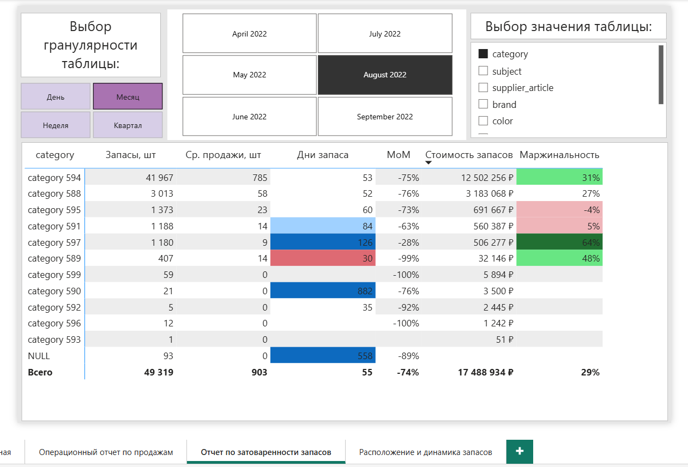
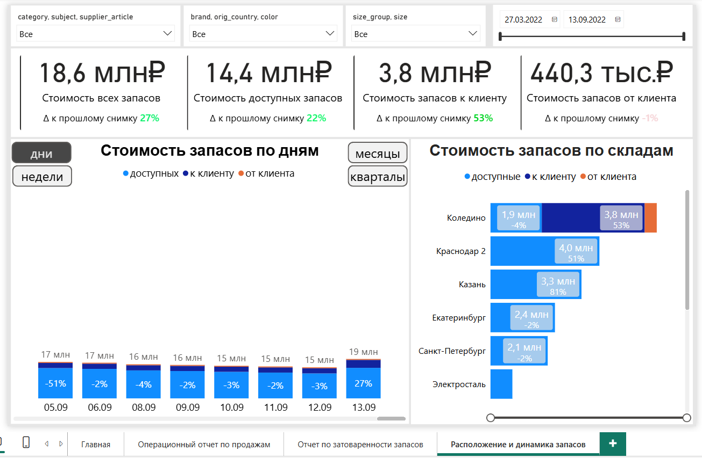

# Wildberries Seller Analytics
BI-решение для анализа продаж и товарных запасов продавца на Wildberries.

Проект построен как end-to-end аналитический pipeline: от загрузки исходных данных и их валидации до формирования аналитических витрин и Power BI-отчетов.

> **Данные**: обезличенный тестовый набор данных.

## Цели проекта
- анализировать продажи и их динамику;
- контролировать маржинальность товарного ассортимента;
- оценивать достаточность товарных запасов;
- выявлять товары с высоким количеством дней запаса;
- анализировать распределение запасов между складами;
- предоставить единую BI-модель для оперативной аналитики.

## Технологии
- Python — ingestion и первичная обработка данных
- PostgreSQL — хранение данных
- dbt — staging, intermediate и marts
- Power BI — семантическая модель, DAX и визуализация
- Docker — инфраструктура
- Git — контроль версий

---

## Архитектура
```text
     WB API / справочники
              |
              ▼
       Python ingestion
              |
              ▼
          PostgreSQL
          raw layer
              |
              ▼
             dbt
     ┌────────┼─────────┐
     ▼        ▼         ▼
  staging intermediate marts
              |
              ▼
           Power BI
```

### Ingestion
Pipeline загрузки данных реализован на Python.

Основные этапы:
1. extract — чтение CSV и Excel;
2. transform — нормализация названий колонок и первичная валидация;
3. load — загрузка данных в PostgreSQL.

Для процесса загрузки реализованы:
- логирование;
- конфигурация через settings;
- единая точка запуска ingestion через main.py.

### dbt
Модели dbt разделены на несколько уровней.

#### Staging
- приведение типов;
- нормализация полей;
- обработка исходных значений;
- подготовка данных для дальнейших преобразований.

#### Intermediate
Нормализация номенклатуры и размеров товаров.

#### Marts
`mart_sales_daily`<br>
Агрегация продаж и объединение с товарными справочниками и себестоимостью.

`mart_warehouse_inventory_daily`<br>
Агрегация складских остатков и расчет стоимости запасов.

`mart_sales_for_inventory`<br>
Подготовка продаж для сопоставления с данными складских остатков.

`mart_inventory_with_sales_daily`<br>
Финальная витрина для совместного анализа продаж и запасов.

`dim_change_date`<br>
Календарная таблица для анализа snapshots и сравнения показателей по дням, неделям, месяцам и кварталам.

---

## Dashboards
### 1. Операционный отчет по продажам

**Цель:** оперативный анализ объема продаж, средней цены продажи, ассортимента и маржинальности.

Основные показатели:
- продажи, шт.;
- средняя цена продажи;
- количество SKU;
- валовая маржинальность;
- динамика продаж;
- динамика маржинальности;
- продажи и маржинальность по товару, региону, бренду, размеру и стране.

  

### 2. Отчет по затоваренности запасов

**Цель:** выявление товаров с избыточными запасами и оценка обеспеченности продаж текущими остатками.

Основные показатели:
- запасы, шт.;
- средние продажи;
- дни запаса;
- изменение дней запаса;
- стоимость запасов;
- маржинальность.

Отчет поддерживает анализ на разных уровнях детализации — от категории до SKU — и переключение между дневной, недельной, месячной и квартальной гранулярностью.

  

### 3. Расположение и динамика запасов

**Цель:** анализ стоимости и структуры запасов во времени и по складам.

Основные показатели:
- общая стоимость запасов;
- стоимость доступных запасов;
- стоимость товара в пути к клиенту;
- стоимость товара в пути от клиента;
- динамика стоимости запасов;
- распределение запасов по складам.

  

---

### Ограничения исходных данных

Исходный тестовый набор содержит неполные и несогласованные snapshots складских остатков.<br>
В частности, на отдельных датах наблюдаются значительные изменения общего количества запасов, которые не объясняются объемом продаж. Поэтому перед использованием inventory snapshots проводится проверка их полноты.<br>
Неполные snapshots исключаются из расчетов показателей запасов.<br>
Восстановление фактического остатка между snapshots не выполняется, поскольку исходные данные не содержат полного набора операций движения товаров.

---

### Что можно развивать дальше
- P&L-отчет;
- отчет по закупкам;
- более глубокий анализ оборачиваемости;
- автоматическое выявление аномальных inventory snapshots;
- автоматизация регулярного обновления данных.
