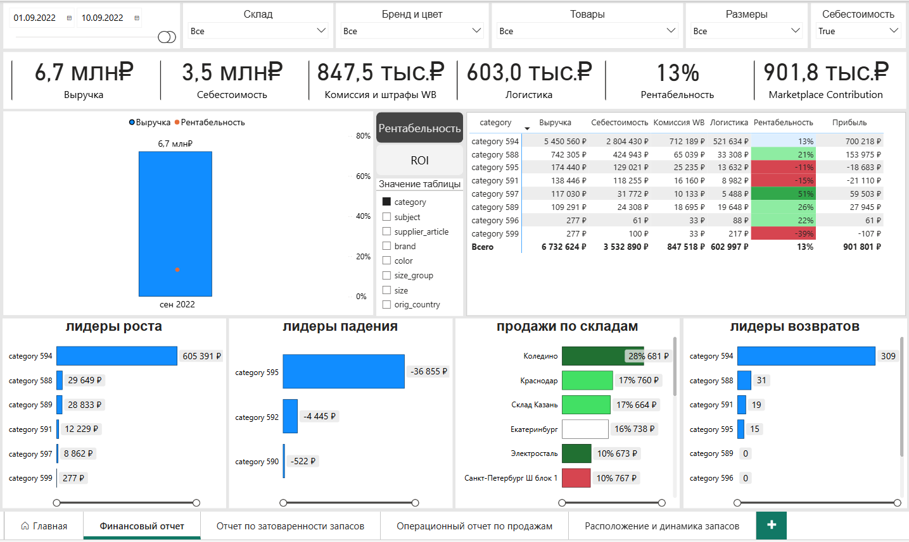
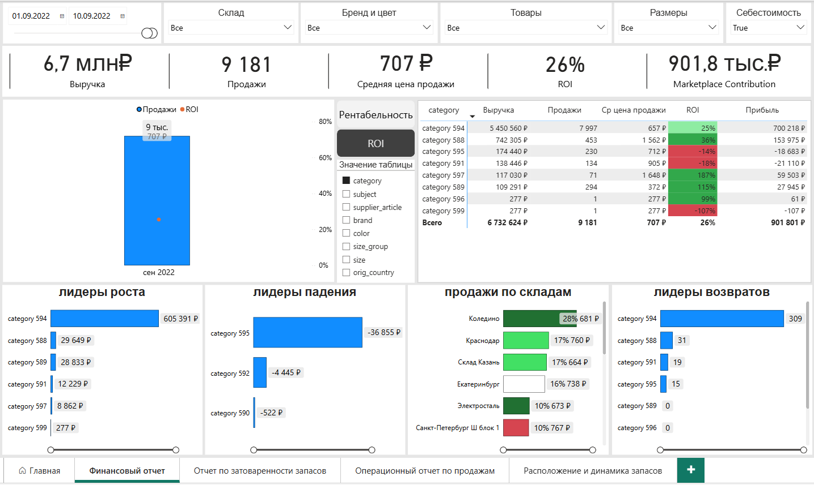
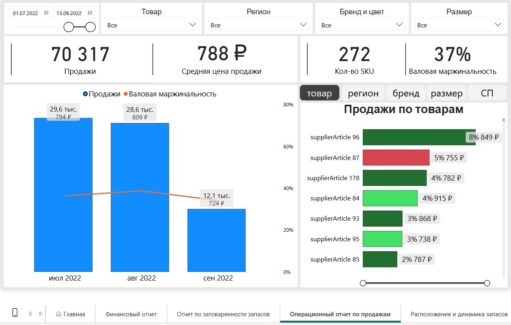
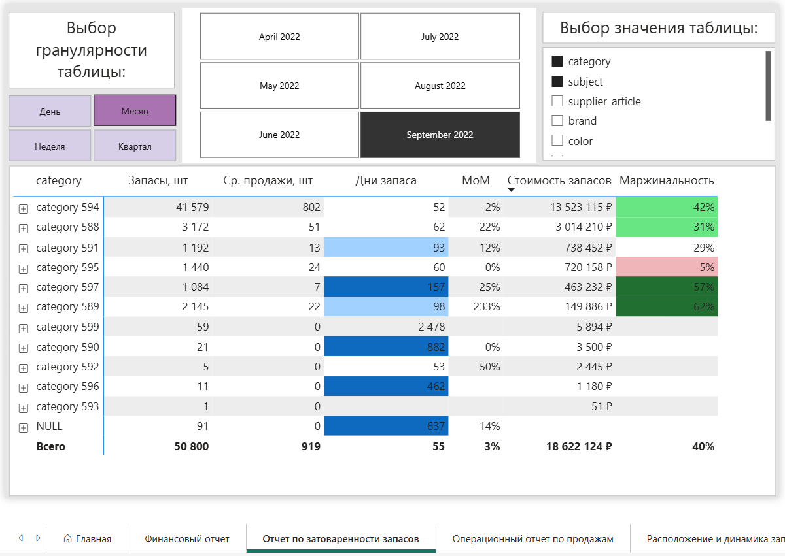
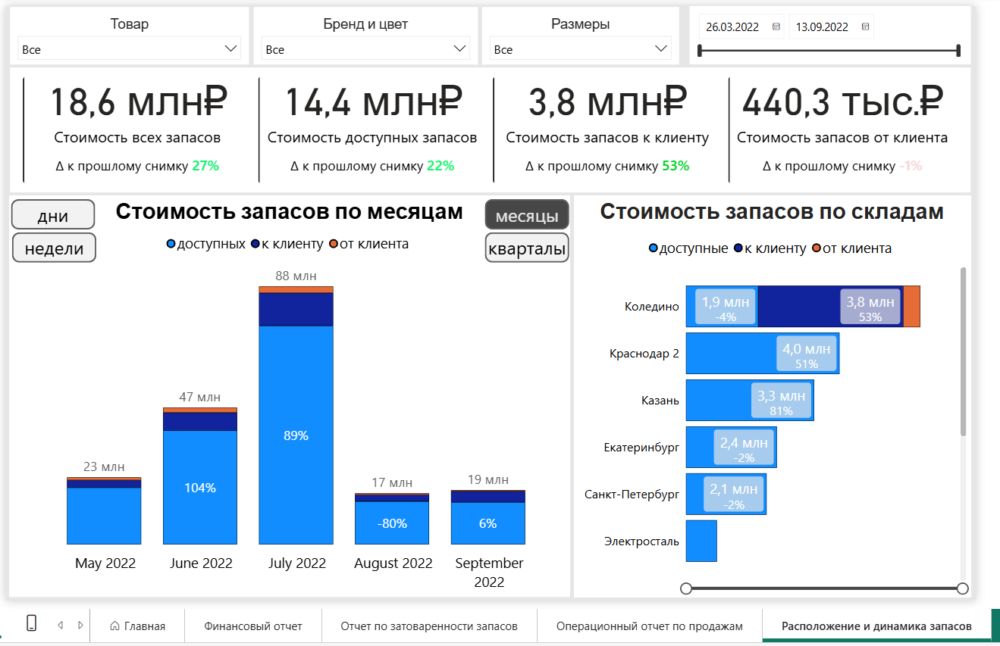

# Wildberries Seller Analytics

**BI-решение для анализа продаж, товарных запасов и финансовой эффективности продавца на Wildberries.**

Проект построен как end-to-end аналитический pipeline: от загрузки исходных данных и их валидации до формирования аналитических витрин и Power BI-отчетов.

> **Данные**: обезличенный тестовый набор данных.

## Цели проекта
- анализировать продажи и их динамику;
- контролировать финансовый результат и эффективность товарного ассортимента;
- оценивать достаточность товарных запасов;
- выявлять товары с высоким количеством дней запаса;
- анализировать распределение запасов между складами;
- предоставить единую BI-модель для оперативной и управленческой аналитики.

## Технологии
- Python — ingestion и первичная обработка данных
- PostgreSQL — хранение данных
- dbt — staging, intermediate и marts
- Power BI — семантическая модель, DAX и визуализация
- Docker — инфраструктура
- Git — контроль версий

---

## Архитектура
```text
   Готовые выгрузки / справочники
              |
              ▼
       Python ingestion
              |
              ▼
          PostgreSQL
          raw layer
              |
              ▼
             dbt
     ┌────────┼──────────────┐
     ▼        ▼              ▼
  staging  intermediate     marts
     |        |              |
     |        |              ├─ sales
     |        |              ├─ inventory
     |        |              └─ P&L
     └────────┴──────────────┘
              |
              ▼
           Power BI
```

### Ingestion
Pipeline загрузки данных реализован на Python.

Основные этапы:
1. extract — чтение CSV и Excel;
2. transform — нормализация названий колонок и первичная валидация;
3. load — загрузка данных в PostgreSQL.

Для процесса загрузки реализованы:
- логирование;
- конфигурация через settings;
- единая точка запуска ingestion через `main.py`.

### dbt
Модели dbt разделены на несколько уровней.

#### Staging
- приведение типов;
- нормализация полей;
- обработка исходных значений;
- подготовка данных для дальнейших преобразований.

#### Intermediate
`int_nomenclature`  
Мастер-модель номенклатуры: сохраняет товарные атрибуты исходного справочника и добавляет размерную группу через `size_mapping`.

`int_pnl`  
Подготовка финансовых операций на уровне исходной строки. Сохраняет `source_barcode` и нормализует отсутствующие или неразрешимые barcode в `UNKNOWN`. Бизнес-классификация операций выполняется в `mart_pnl`.

#### Marts
`mart_sales_daily`<br>
Ежедневная агрегация продаж по товару и региону с расчетом выручки, суммы к выплате, себестоимости и валовой прибыли.

`mart_warehouse_inventory_daily`<br>
Ежедневная агрегация складских остатков по товару и складу, включая стоимость запасов по себестоимости и контроль ее доступности.

`mart_sales_for_inventory`<br>
Подготовка дневных продаж для сопоставления со складскими snapshots и контроль отсутствия соответствующего snapshot.

`mart_inventory_with_sales_daily`<br>
Совместная витрина запасов и продаж: продажи распределяются по интервалам между snapshots, а несопоставимые продажи сохраняются отдельно.

`mart_pnl`<br>
Управленческая финансовая витрина продавца. Содержит продажи, возвраты, сумму к выплате, комиссию WB, логистику, штрафы, COGS, Gross Profit и Marketplace Contribution.

`dim_change_date`<br>
Календарная и служебная таблица для анализа складских snapshots, включая признак валидности и ссылки на предыдущие валидные snapshots.

---

## Dashboards
### 1. Финансовый отчет

**Цель:** оценка финансового результата и эффективности продаж на маркетплейсе.

Основные показатели:
- выручка с учетом сторно;
- продажи и возвраты;
- себестоимость (COGS);
- комиссия WB;
- логистика с учетом сторно;
- штрафы;
- Gross Profit;
- Marketplace Contribution;
- рентабельность;
- ROI;
- динамика и эффективность товарного ассортимента.






### 2. Операционный отчет по продажам

**Цель:** оперативный анализ объема продаж, средней цены продажи, ассортимента и маржинальности.

Основные показатели:
- продажи, шт.;
- средняя цена продажи;
- количество SKU;
- валовая маржинальность;
- динамика продаж;
- динамика маржинальности;
- продажи и маржинальность по товару, региону, бренду, размеру и стране.

  

### 3. Отчет по затоваренности запасов

**Цель:** выявление товаров с избыточными запасами и оценка обеспеченности продаж текущими остатками.

Основные показатели:
- запасы, шт.;
- средние продажи;
- дни запаса;
- изменение дней запаса;
- стоимость запасов;
- маржинальность.

Отчет поддерживает анализ на разных уровнях детализации — от категории до SKU — и переключение между дневной, недельной, месячной и квартальной гранулярностью.

  

### 4. Расположение и динамика запасов

**Цель:** анализ стоимости и структуры запасов во времени и по складам.

Основные показатели:
- общая стоимость запасов;
- стоимость доступных запасов;
- стоимость товара в пути к клиенту;
- стоимость товара в пути от клиента;
- динамика стоимости запасов;
- распределение запасов по складам.

  

---

## Работа с товарными ключами

В обезличенном финансовом отчете часть строк содержит barcode, отсутствующие в мастер-справочнике, а в отдельных операциях barcode отсутствует. Надежно восстановить все соответствия по другим идентификаторам не удалось.

Поэтому:
- исходный barcode сохраняется в `source_barcode`;
- для финансовой аналитики неразрешимые и отсутствующие barcode преобразуются в техническое значение `UNKNOWN` на уровне `int_pnl`;
- финансовые данные при этом не удаляются и продолжают участвовать в агрегатах P&L;
- товарные атрибуты для `UNKNOWN` остаются пустыми.

Такой подход позволяет не искажать финансовые суммы ради принудительного сопоставления с номенклатурой.

---

## Ограничения исходных данных

Исходный тестовый набор содержит неполные и несогласованные snapshots складских остатков.

В частности, на отдельных датах наблюдаются значительные изменения общего количества запасов, которые не объясняются объемом продаж. Поэтому перед использованием inventory snapshots проводится проверка их полноты.

Неполные snapshots исключаются из расчетов показателей запасов.

Восстановление фактического остатка между snapshots не выполняется, поскольку исходные данные не содержат полного набора операций движения товаров.

Для финансового отчета часть строк не имеет надежного соответствия с мастер-справочником по barcode. Такие операции сохраняются под `UNKNOWN`; показатели, зависящие от себестоимости, рассчитываются только для строк с доступным `cost_price`.

---

### Что можно развивать дальше
- отчет по закупкам;
- более глубокий анализ оборачиваемости;
- прогнозирование продаж и запасов;
- автоматическое выявление аномальных inventory snapshots;
- автоматизация регулярного обновления данных.
